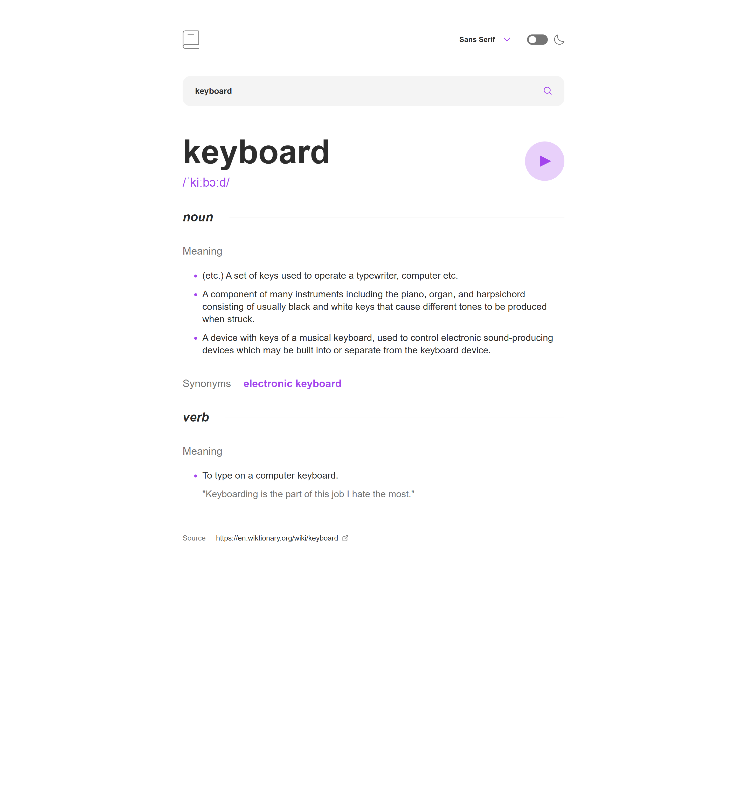
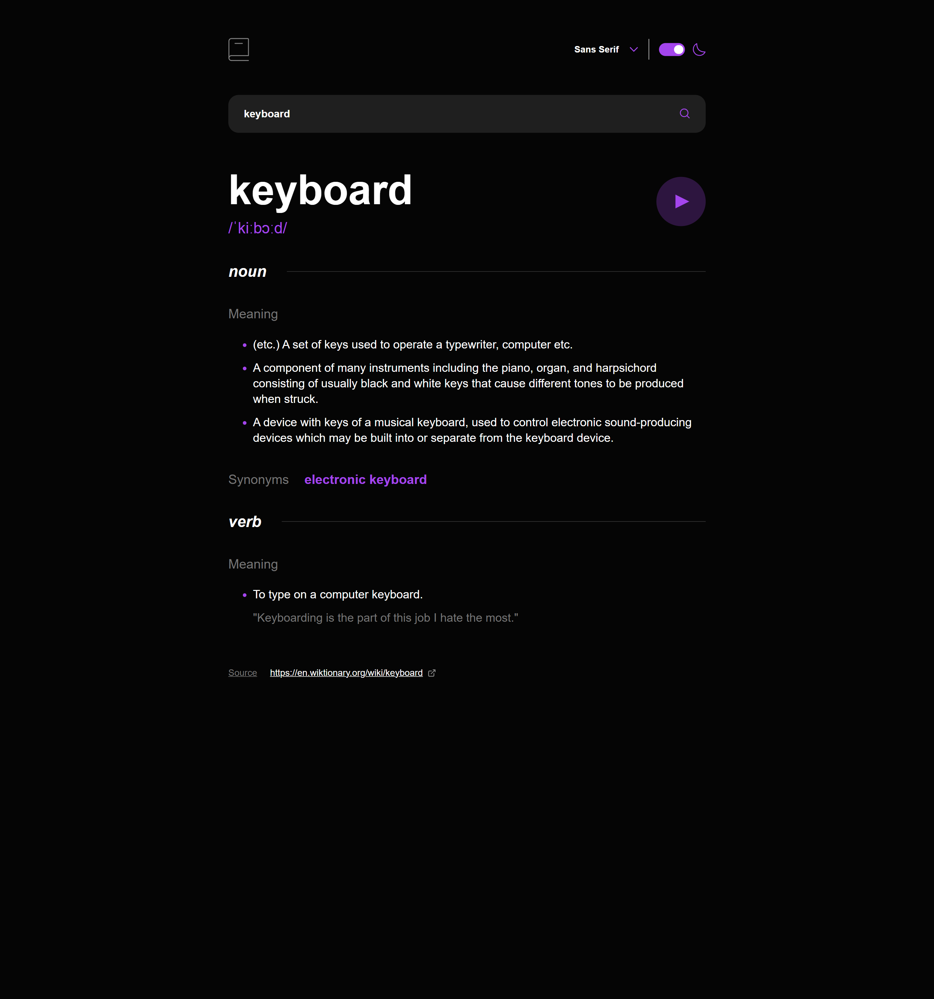
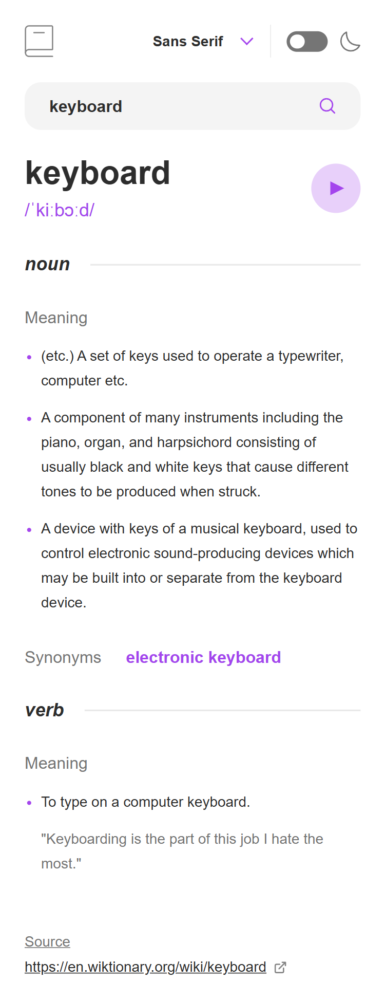
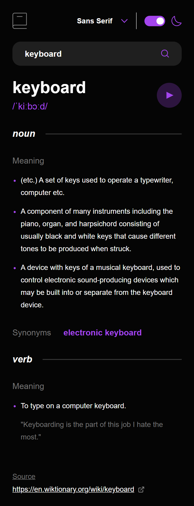

# Frontend Mentor - Dictionary web app solution

This is a solution to the [Dictionary web app challenge on Frontend Mentor](https://www.frontendmentor.io/challenges/dictionary-web-app-h5wwnyuKFL). Frontend Mentor challenges help you improve your coding skills by building realistic projects.

### The challenge

Users should be able to:

- Search for words using the input field
- See the Free Dictionary API's response for the searched word
- See a form validation message when trying to submit a blank form
- Play the audio file for a word when it's available
- Switch between serif, sans serif, and monospace fonts
- Switch between light and dark themes
- View the optimal layout for the interface depending on their device's screen size
- See hover and focus states for all interactive elements on the page
- **Bonus**: Have the correct color scheme chosen for them based on their computer preferences. _Hint_: Research `prefers-color-scheme` in CSS.

### Screenshot

<table>
  <tr>
    <td></td>
    <td></td>
  </tr>
  <tr>
    <td></td>
    <td></td>
 
  </tr>
</table>

### Links

- Solution URL: https://www.frontendmentor.io/solutions/mzdemir-dictionary-web-app-with-react-Vu-lJTCyQ6
- Live Site URL: https://mzdemir-dictionary-web-app.netlify.app/

### Built with

- [React](https://reactjs.org/) - JS library
- Fetch API
- Semantic HTML5
- CSS custom properties (CSS variables)
- Mobile-first workflow
- Accessible custom UI components (custom select / dropdown)

### What I learned

This project helped reinforce several core React and frontend concepts:

- Managing form state and validation in React without overcomplicating logic
- Conditionally applying class names based on state (e.g. empty input feedback)
- Building an accessible custom dropdown using native buttons and ARIA attributes
- I prefered to build custom components without using any library like styled components
- Fetching and handling API responses, including error and empty states
- Prioritizing accessibility (keyboard navigation, focus states, ARIA roles)

### Useful resources

- https://dictionaryapi.dev/ – Free Dictionary API used in this project

## Author

- Githup - [Mzdemir](https://github.com/mzdemir)
- Frontend Mentor - [@mzdemir](https://www.frontendmentor.io/profile/mzdemir)
